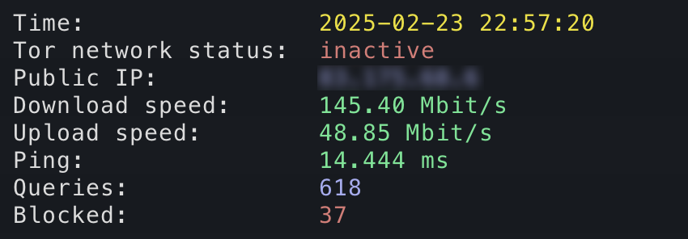

# PiGuard — Raspberry Pi Security Gateway 🛡️

**PiGuard** is a lightweight but powerful network security setup running on a Raspberry Pi 4B. It combines **Pi-hole**, **Tor network routing**, and a **real-time CLI dashboard** to monitor your network traffic, block ads, and anonymize all outgoing connections with the push of a button.

---

## Features

- ✅ DNS filtering and ad blocking via **Pi-hole**
- ✅ Optional full network traffic routing through **Tor**
- ✅ Live statistics via a **Python-based CLI dashboard**
- ✅ Easy toggling of Tor on/off with a Python script
- ✅ Headless operation over **SSH**

---

## Hardware Requirements

- Raspberry Pi 4B (2GB RAM or more recommended)
- 16GB+ microSD card with Raspberry Pi OS Lite
- LAN or Wi-Fi connection (Ethernet recommended)
- Power supply (min. 3A for RPi4)
- Optional: 3.5-inch touchscreen (used in CLI mode only)

---

## Software Stack

- [Pi-hole](https://pi-hole.net) — DNS filtering
- [Tor](https://www.torproject.org) — for anonymized routing
- `iptables` — for dynamic traffic redirection
- Python 3 — custom dashboard + toggle scripts
- `speedtest-cli` — for bandwidth testing

---

## Quick Start

> Full installation guide is in `install_instructions.md`

### 1. Install Pi-hole
```bash
curl -sSL https://install.pi-hole.net | bash
```
During the setup:
- Set a static IP (e.g., `192.168.178.250`)
- Enable web interface
- Choose Cloudflare or Google as upstream DNS

### 2. Set DNS on your router
Set the DNS server to your Pi-hole IP (e.g., `192.168.178.250`) in your router settings to enforce network-wide DNS filtering.

### 3. Install Tor
```bash
sudo apt install tor -y
```
Edit `/etc/tor/torrc` to add:
```ini
AutomapHostsOnResolve 1
TransPort 9040
DNSPort 5353
VirtualAddrNetworkIPv4 10.192.0.0/10
```

---

## Scripts Included

### `dispinfo.py` — CLI Dashboard
Displays current stats every 60 seconds (adjustable):
- Time, Tor status, Public IP
- Download/upload speeds, ping
- Pi-hole: queries + ads blocked

### `toggle_tor.py`
Enables or disables Tor and updates iptables routing accordingly.

---

## Security Note ⚠️
This project is intended for educational and personal use. Make sure to **never expose sensitive keys or IP addresses**. Public IPs and API tokens used in this repository are **anonymized** or replaced with placeholders.

---

## Planned Upgrades
- [ ] VPN access via WireGuard
- [ ] Remote control panel (web or mobile)
- [ ] JSON logging or CSV export
- [ ] Optional relay or proxy mode

---

## License
This project is licensed under the MIT License. See `LICENSE` for more information.

---

## Preview


---

Made with ❤️ by David Hudáček [@david_hudacek]
